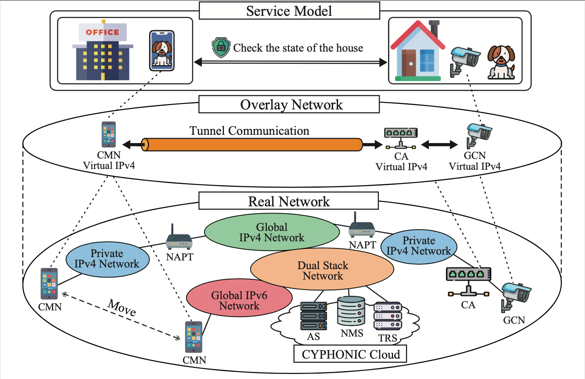
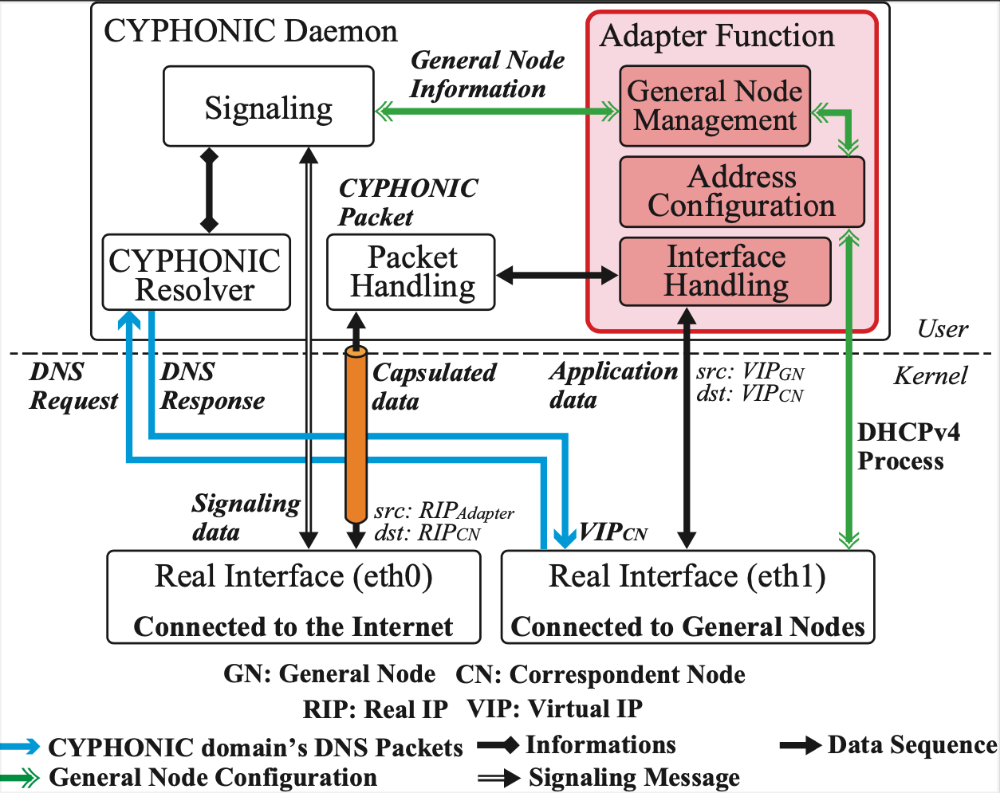
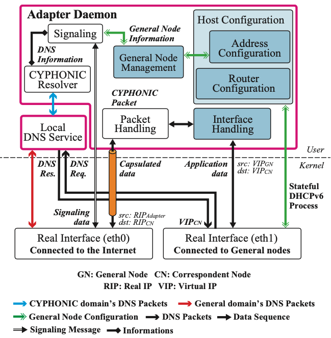
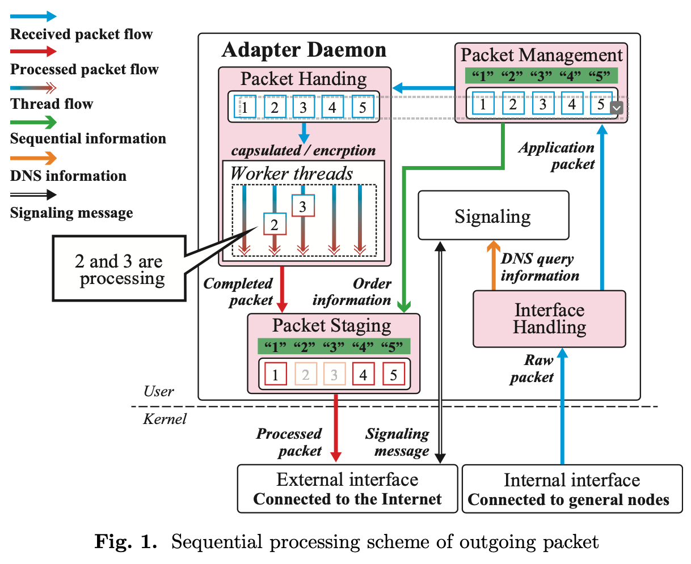

# Concepts

## Concept of CYPHONIC

CYber PHysical Overlay Network over Internet Communication (CYPHONIC) is a proprietary protocol of Naito Laboratory (Pluslab).

CYPHONIC is a proven overlay network protocol supporting secure IP mobility technology that works on both IPv4 and IPv6 networks.

CYPHONIC provides secure and continuous end-to-end communication including encryption between end-nodes, NAPT traversal in IPv4 networks, continuous unbroken IP mobility anywhere, and full connectivity in IPv4/IPv6 networks.

## Overview

The cloud service has several functions such as Authentication Service (AS), Node Management Service (NMS), and Tunnel Relay Service (TRS).

AS provides the authentification process for CYPHONIC nodes.

Additionally, it also assigns a Fully Qualified Domain Name (FQDN) as an identifier of a CYPHONIC node and distributes a shared encryption key for communication between NMS and CYPHONIC nodes.

NMS is a managing function for each CYPHONIC nodes.

It stores information about the network location of each CYPHONIC node and decides a tunnel establishing process according to the stored information.

TRS provides a relay service for communication between IPv4 and IPv6 networks and communication between private networks.

## Concept of CYPHONIC adapter

Since CYPHONIC node must install the unique device program called CYPHONIC Daemon, it also requires flexible specification to accept the additional installation into the end node. 

On the contrary, some end nodes for IoT or embedded devices limit device resources. 

Therefore, it may be difficult for these devices to install the CYPHONIC Daemon. 

Additionally, some particular server tends to refuse the additional installation because they have concerned about the effect on the stability and reliability of their service. 

As a result, CYPHONIC should support these general nodes without installing the CYPHONIC Daemon.

This repository develops an adapter device called CYPHONIC adapter to provide a function to join the CYPHONIC network for general nodes.

General nodes can be connected to adjacent CYPHONIC adapters to communicate over our overlay network without installing CYPHONIC Daemon.

Since the CYPHONIC adapter performs processing for CYPHONIC communication instead of the general nodes, it interconnects the general nodes and CYPHONIC end nodes. 
